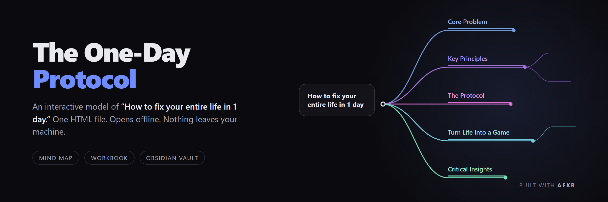
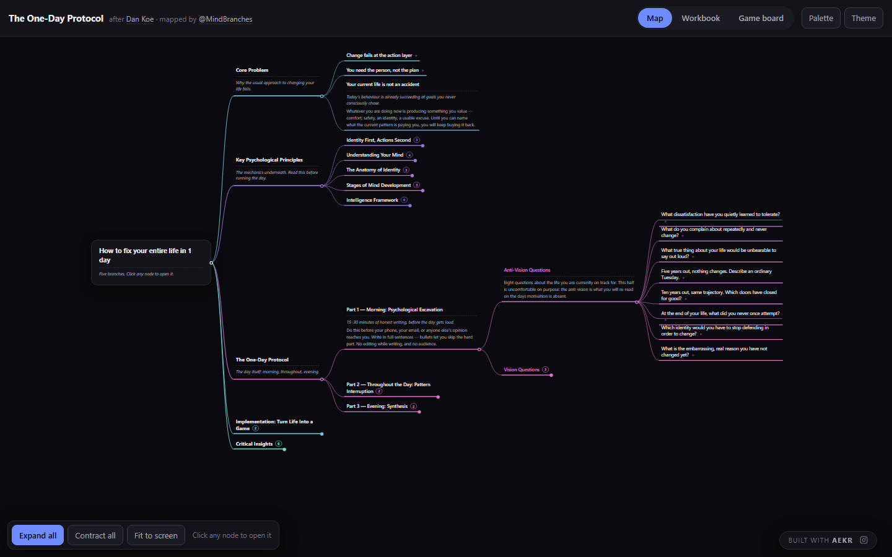
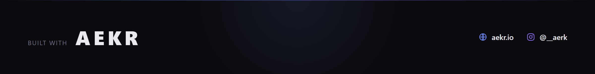

An interactive model of **"How to fix your entire life in 1 day"** by [Dan Koe](https://thedankoe.com/), organised after the mind map by [@MindBranches](https://x.com/MindBranches/status/2078988089393901842).

**[⬇ Download](https://github.com/edlopezpm-ops/one-day-protocol/releases/latest)** · **[Run the day](docs/SOP-03-run-the-day.md)** · Built with **[AEKR](https://aekr.io)** · **[@__aerk](https://www.instagram.com/__aerk/)**

---

## Start

1. Download `One-Day-Protocol.zip` from the [latest release](https://github.com/edlopezpm-ops/one-day-protocol/releases/latest).
2. Unzip it. *(Windows: right-click → Extract All. Mac: double-click.)*
3. Double-click **`One Day Protocol.html`**.

That's the whole install — one file, no account, no internet.

| Tab | What it does |
| --- | --- |
| **Map** | Click the centre button, then keep clicking. Every node opens into a short explanation. Expand all / Contract all at the bottom left. |
| **Workbook** | Every question with a box to type in. Saves as you type, exports to Markdown. |
| **Game board** | Your answers as a game: stakes, six components, three horizons. |

Stuck on any of it → **[docs/SOP-01-browser.md](docs/SOP-01-browser.md)**

## Obsidian

Download `Obsidian-Vault.zip` from the same release, then *Open folder as vault* → pick `vault`. Wiki-linked notes, a Canvas mind map, and a fill-in worksheet. Details → **[docs/SOP-02-obsidian.md](docs/SOP-02-obsidian.md)**

## The day itself

The map is theory. **[docs/SOP-03-run-the-day.md](docs/SOP-03-run-the-day.md)** is the part that does something — morning excavation, six alarms, evening synthesis. The Workbook generates a `.ics` that puts the alarms on your phone.

## Privacy

Zero network requests — no analytics, no fonts, no CDN. Works with the Wi-Fi off. Answers live in your browser's local storage and nowhere else, so clearing browser data erases them: press **Export Markdown** when you're done.

## Credits, licence, caveat

The thinking belongs to Dan Koe and @MindBranches, not to me — see **[CREDITS.md](CREDITS.md)**. Code [MIT](LICENSE), text [CC BY 4.0](LICENSE-CONTENT.md).

Educational and self-reflection material. Not therapy, medical, or mental-health advice.

---

<b>Español — inicio rápido</b>

1. Baja `One-Day-Protocol.zip` desde [releases](https://github.com/edlopezpm-ops/one-day-protocol/releases/latest) y descomprímelo.
2. Doble clic en **`One Day Protocol.html`**. Se abre en tu navegador. Listo.

En **Map**, haz clic en el botón del centro y sigue haciendo clic: cada nodo se abre con su explicación. **Workbook** son las preguntas con cajas para escribir (se guarda solo). **Game board** muestra tus respuestas como tablero.

Todo se queda en tu computador; la página no se conecta a internet. Usa **Export Markdown** antes de cerrar.

Para Obsidian, baja `Obsidian-Vault.zip` y abre la carpeta `vault` como bóveda.

Guía del día completo: [docs/SOP-03-run-the-day.md](docs/SOP-03-run-the-day.md)

---

**[aekr.io](https://aekr.io)** · **[@__aerk on Instagram](https://www.instagram.com/__aerk/)**
